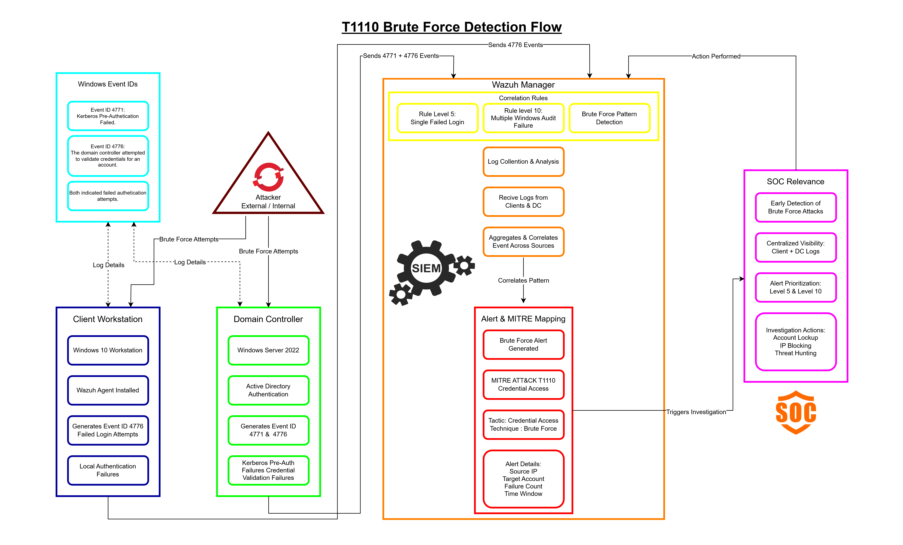
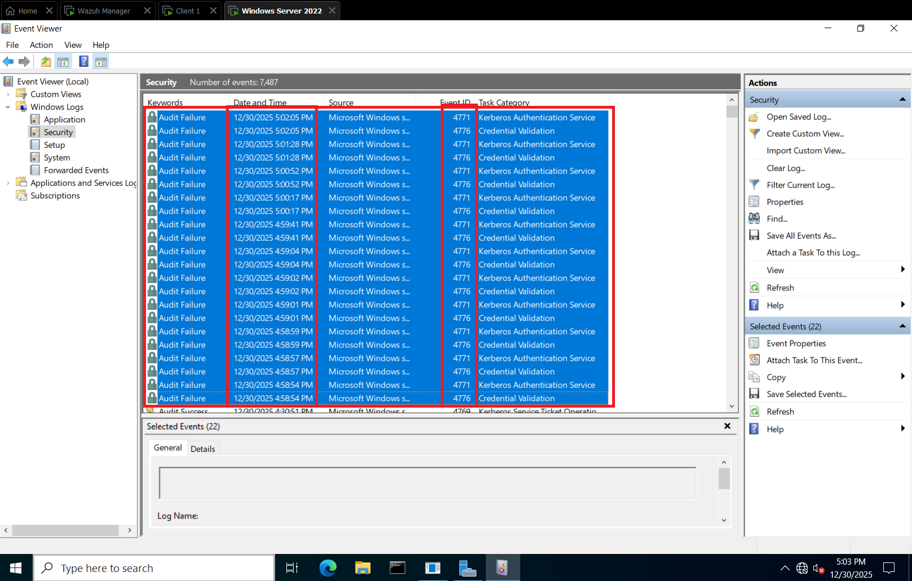
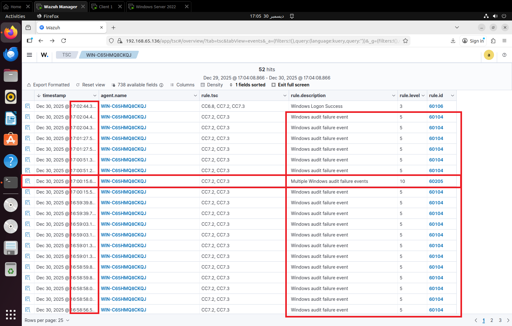
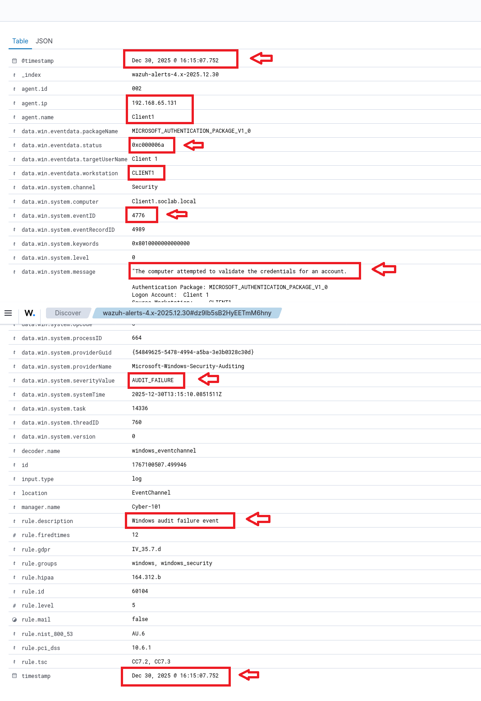

# T1110 – Brute Force (Credential Access)

## Overview
Brute force is an attack technique aimed at gaining access by repeatedly guessing passwords until access is granted or a defense is crossed. It typically targets human-created passwords and falls under the **Credential Access tactic**. Attackers exploit weak controls without requiring malware or exploits.

On Windows systems, brute force activity commonly manifests as:

- Repeated authentication failures  
- Kerberos pre-authentication failures (Event ID 4771)  
- NTLM or network logon failures (Event ID 4776)  

These events are noisy, making it a filtering and judgment test for analysts. Challenges include distinguishing:

- User mistakes  
- Misconfigured services  
- Automated password spraying  
- Targeted credential attacks  

T1110 is often an **early-stage signal**. Success can enable advanced techniques like Valid Accounts, Lateral Movement, and Privilege Escalation. If unnoticed, it provides attackers with intelligence about usernames, lockout policies, and detection gaps.

---

## Lab Observations
- **Client behavior:** Windows domain clients generate **4776** logs for failed logins. They send logs directly to Wazuh Manager; logs do **not** pass through the Domain Controller.  
- **Domain Controller behavior:** Failed login attempts generate **two logs**:  
  - 4771 – Kerberos authentication failed  
  - 4776 – Credentials did not match  

- **Wazuh detection:**  
  - Alerts for most failed logins assigned **rule level 5**  
  - One additional alert, “Multiple Windows Audit Failure,” fired at **rule level 10** (Event status 0x18, Event ID 4771)  
  - This special log is **not visible in Windows Event Viewer**, indicating Wazuh correlation rules detecting repeated failures  

- **Timestamps observed:** 30/12/2025, 4:58:54 PM to 5:02:05 PM  

- **Client screenshots:** Show only 4776 logs with rule level 5  

---

## Interpretation / MITRE Classification
Based on repeated failed authentication attempts across the Domain Controller and clients, this activity is classified as **MITRE ATT&CK technique T1110 (Brute Force)** under the **Credential Access** tactic.

**Key points:**  
- Domain failed login attempts generate both 4771 & 4776, reflecting central authentication failure  
- Clients generate 4776 only, consistent with agent-per-host deployment sending logs directly to Wazuh Manager  
- Wazuh correlates multiple attempts into a higher-severity alert, showing pattern recognition  

---

**SOC relevance:**  
- Detects early brute force activity  
- Centralized visibility for clients and DC  
- MITRE mapping provides context for analysts  
- Alerts help prioritize investigation  

---

## Diagram Placeholder

**Diagram elements:**  
- Domain Client / Workstation (generates 4776)  
- Domain Controller (generates 4771 & 4776)  
- Wazuh Agent & Manager (alert detection & rule levels)  
- Alert / MITRE mapping (T1110, Credential Access)

## Screenshots
1. Domain Controller Event Viewer showing 4771 & 4776 logs

2. Wazuh row view of all logs including the special multiple-login alert

3. Detailed view of the “multiple login attempts” alert in Wazuh

4. Client 1 Event Viewer showing 4776 logs

5. Client 1 detailed log view in Wazuh

